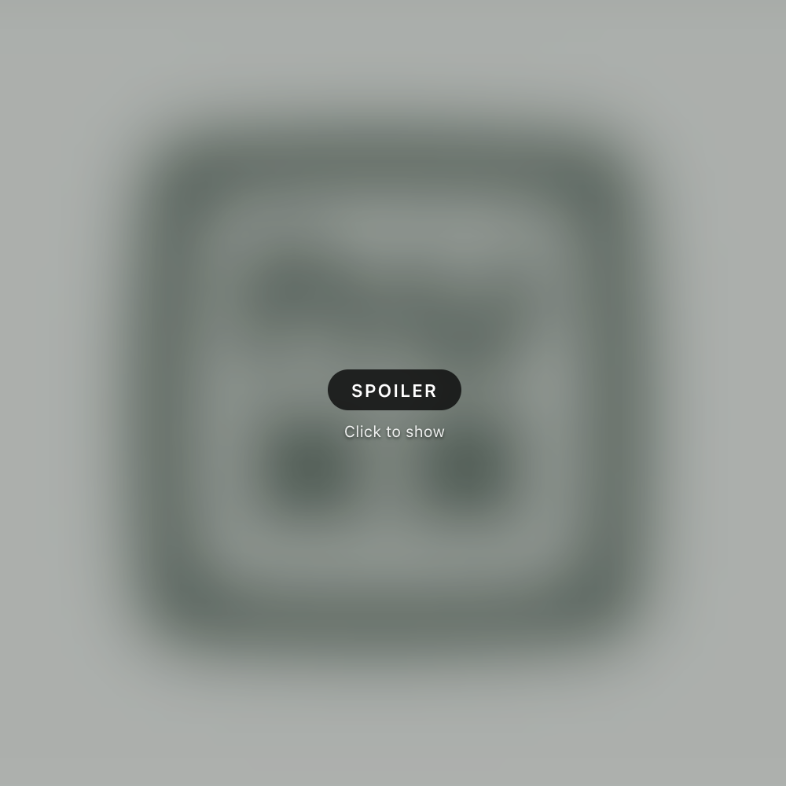

# Spoiler

Spoilers for WordPress: blur images and obscure text behind a click-to-reveal content warning. Useful for spoilers, NSFW content, medical images, or anything else a reader should opt into seeing.




## Features

- **Spoiler block** — wrap any content (images, galleries, paragraphs, embeds) in a container that blurs it under a translucent overlay with a warning pill. One click reveals it; a small corner button hides it again. State resets on page reload.
- **Inline spoiler text format** — obscure a word or phrase mid-sentence with a solid bar. Click (or focus + Enter/Space) toggles it.
- **Warning label presets** — Spoiler, NSFW, Medical image, Content warning — plus a free-text field, per block.
- **First-class editor integration**:
  - Block inserter entry (search "spoiler", "nsfw", "hide", "blur"…)
  - "Turn into Spoiler" — select any block(s) and transform them into a Spoiler; Ungroup (in the block's options menu) or the keyboard shortcut transforms back
  - Toolbar button for the inline format (under the ¶ formatting menu)
  - Keyboard shortcut `Shift+Alt+S` (Windows/Linux) / `Ctrl+Option+S` (Mac): with text selected, toggles the inline spoiler; with block(s) selected, wraps them in a Spoiler block (or unwraps a selected Spoiler)
  - "Preview hidden state" toolbar toggle so you can see what visitors will see
- **Accessibility-minded** — the overlay is a real button; hidden content is `inert` and `aria-hidden` until revealed, so screen readers, tab order, and find-in-page can't leak it. Reveal/re-hide manage focus. `prefers-reduced-motion` is respected.
- **Fails closed without JavaScript** — markup ships in the hidden state; no JS means content stays hidden.

## Caveats

This is courtesy hiding, not security: the content is present in the page HTML and appears un-hidden in RSS feeds and to non-CSS consumers. Don't use it for anything truly secret.

## Installation

1. Grab the latest release zip from the [releases page](https://github.com/c0nsumer/nuxx-spoiler/releases).
2. In WordPress admin: Plugins → Add New Plugin → Upload Plugin → choose the zip → Activate.

## Development

Requires Node.js ≥ 20.10.

```sh
npm install
npm run build        # production build into build/
npm run start        # watch mode
npm run env start    # local WordPress via wp-env (requires Docker)
npm run plugin-zip   # build an installable release zip
```

## Translations

Translations for ten locales are bundled (`de_DE`, `es_ES`, `fr_FR`, `it_IT`, `nl_NL`, `pl_PL`, `pt_BR`, `ru_RU`, `ja`, `zh_CN`) and load automatically when a site uses one of those languages. They are machine translations (AI-generated) that have not been reviewed by native speakers — corrections are very welcome, either as edits to the `.po` files in `languages/` or to the source table in `tools/translations.json`.

To regenerate after strings change (requires `wp-env` running):

```sh
npm run env run cli -- wp i18n make-pot wp-content/plugins/<dir> wp-content/plugins/<dir>/languages/nuxx-spoiler.pot --exclude=node_modules,src --domain=nuxx-spoiler
python3 tools/generate-po.py languages/nuxx-spoiler.pot tools/translations.json languages
npm run env run cli -- wp i18n make-mo wp-content/plugins/<dir>/languages
npm run env run cli -- wp i18n make-json wp-content/plugins/<dir>/languages --no-purge
```

## Theming

The inline spoiler bar color can be overridden by a theme:

```css
:root {
	--nuxx-spoiler-bar: #333;
}
```

## License

GPL-2.0-or-later. See [LICENSE](LICENSE).
